# Instalación de node.js en windows 10/11 con docker

## Instalación de Docker Desktop

Antes de nada debemos descargar el instalador de Docker Desktop donde funcionará node desde [aquí](https://www.docker.com/get-started/).

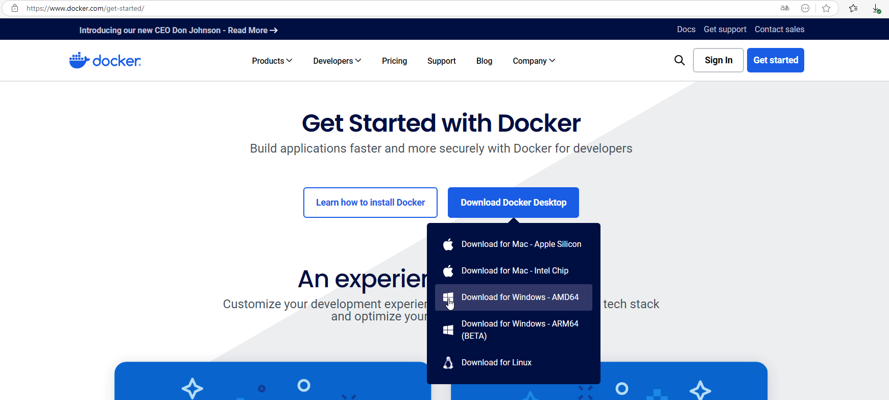

Al ejecutar el instalador veremos algo parecido a esto, esperaremos:

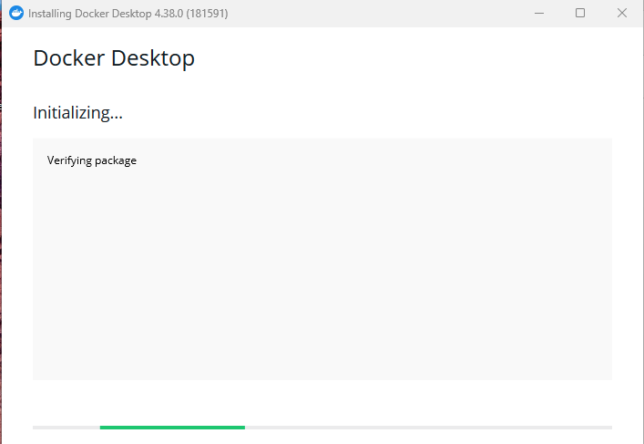

Cuando termine veremos las siguientes opciones que debemos dejar como vienen:

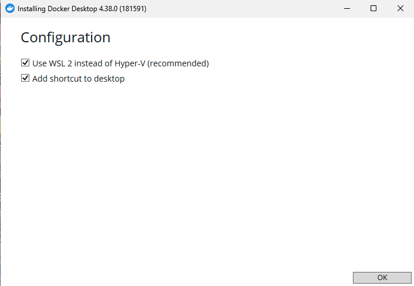

> 🚀¿Sabías que?
>
> WSL corresponde a las siglas de Windows Subsystem for Linux ya que es una pequeña maquina virtual de Ubuntu de solo terminal para Windows. Docker la usa para ejecutar sus comandos ya que fueron diseñado para linux

Tras aceptar se llevará a cabo la instalación la cual no demora demasiado:

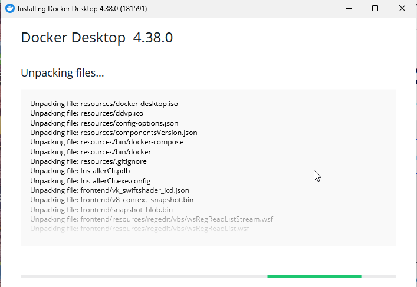

Cuando la instalación termine nos pedirá reiniciar nuestra máquina, aceptamos:

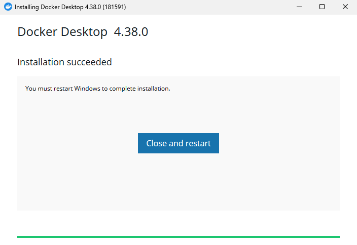

Al arrancar, docker nos pedirá aceptar unos terminos y condiciones, pulsaremos Accept:


Esto nos llevará al ultimo paso de la instalación que será dejando las opciones por defecto como se ve en la imagen y pulsando en Finish.

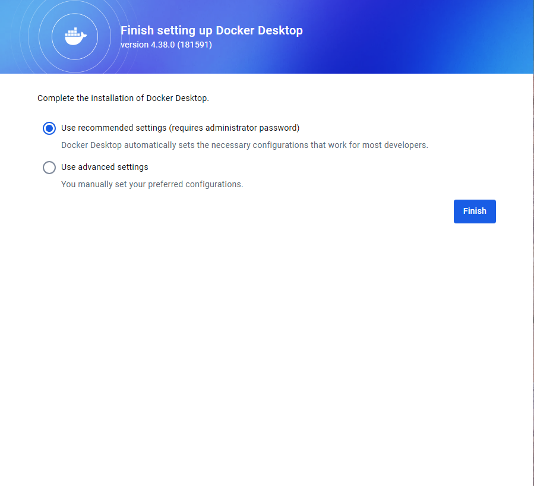

En algún momento aparecerá una ventana como la de la imagen, no debemos asustarnos, es WSL diciendonos hola, solo debemos hacer click en la ventana y pulsar intro para que termine de instalarse:

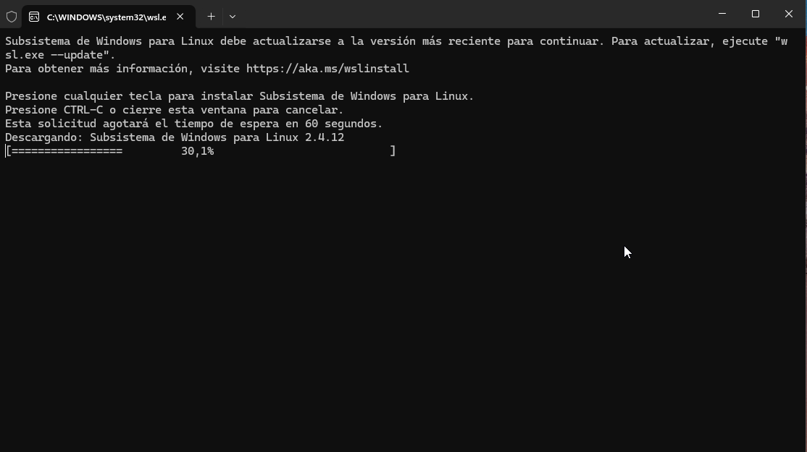

Si todo va bien veremos algo así, pulsamos intro y se cerrará la ventana:

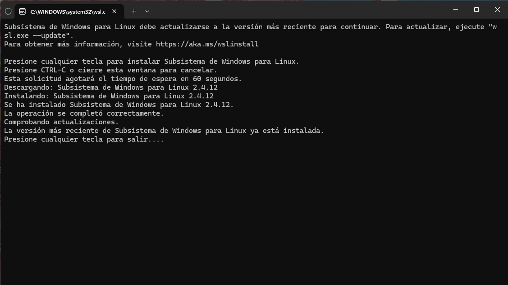

¡Bien! Ya tenemos Docker desktop instalado y el acceso directo en el escritorio:

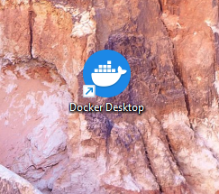

## Inicio de docker

Haremos doble click en el icono del escritorio y veremos algo como lo de la imagen. Debemos iniciar sesión, lo mas facil es hacerlo con google pero tambien podemos usar github:

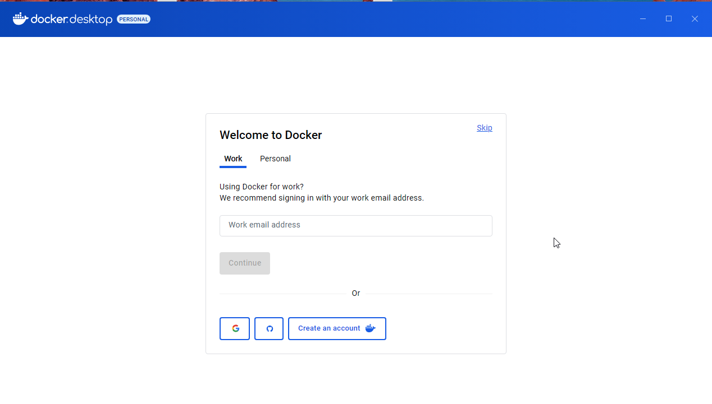

Después veremos algo así, yo uso el modo oscuro y vosotros probablemente tendreis un docker de ejemplo, no pasa nada si es ligeramente diferente:

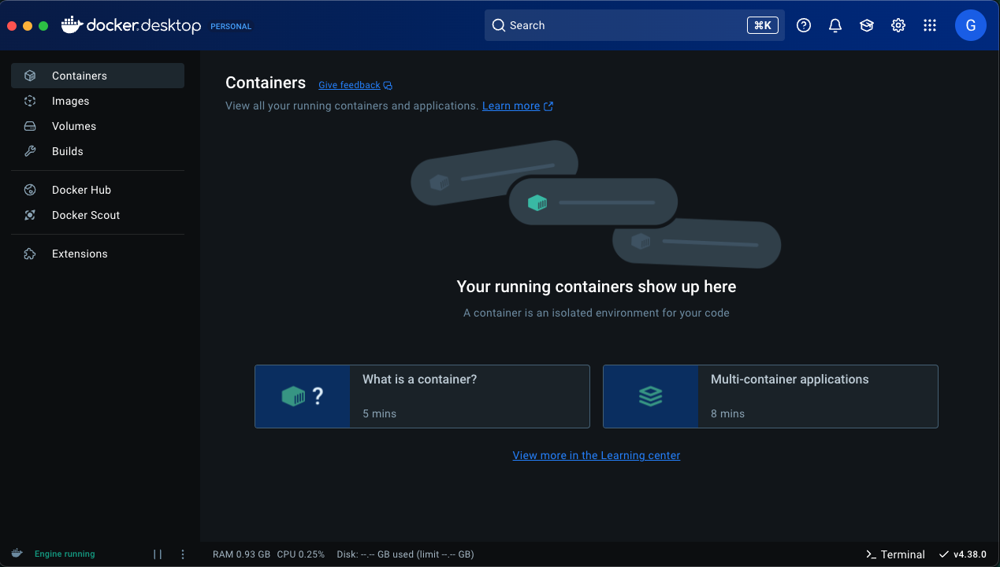

## Arranque del docker en Visual Studio Code

Debemos abrir una carpeta vacía para nuestro proyecto en visual y crear un archivo llamado estrictamente `docker-compose.yml` ahí pegaremos lo siguiente:

```YML
services:
  node-app:
    image: node:22
    container_name: node-app
    working_dir: /app
    volumes:
      - ./app:/app
    command: sh -c "npm init -y && npm install -g nodemon && nodemon --legacy-watch index.js"
    ports:
      - "3000:3000"
    environment:
      - NODE_ENV=development
    stdin_open: true
    tty: true

```

Debe quedar así:

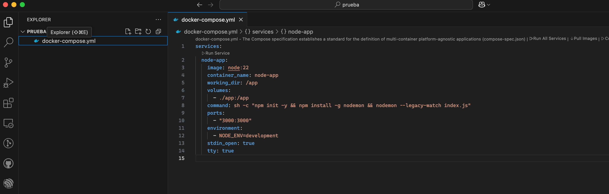

Tras esto abriremos una terminal desde el menú superior `Terminal` de la siguiente forma:

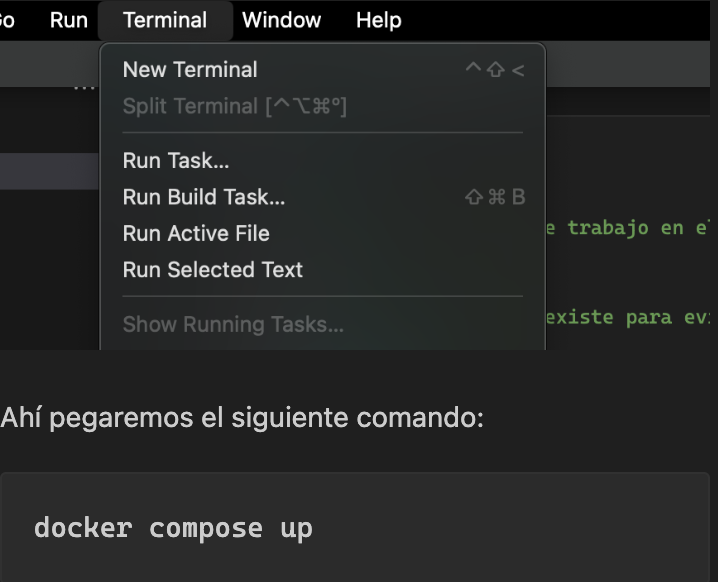

Ahí pegaremos el siguiente comando:

```bash
docker compose up
```
